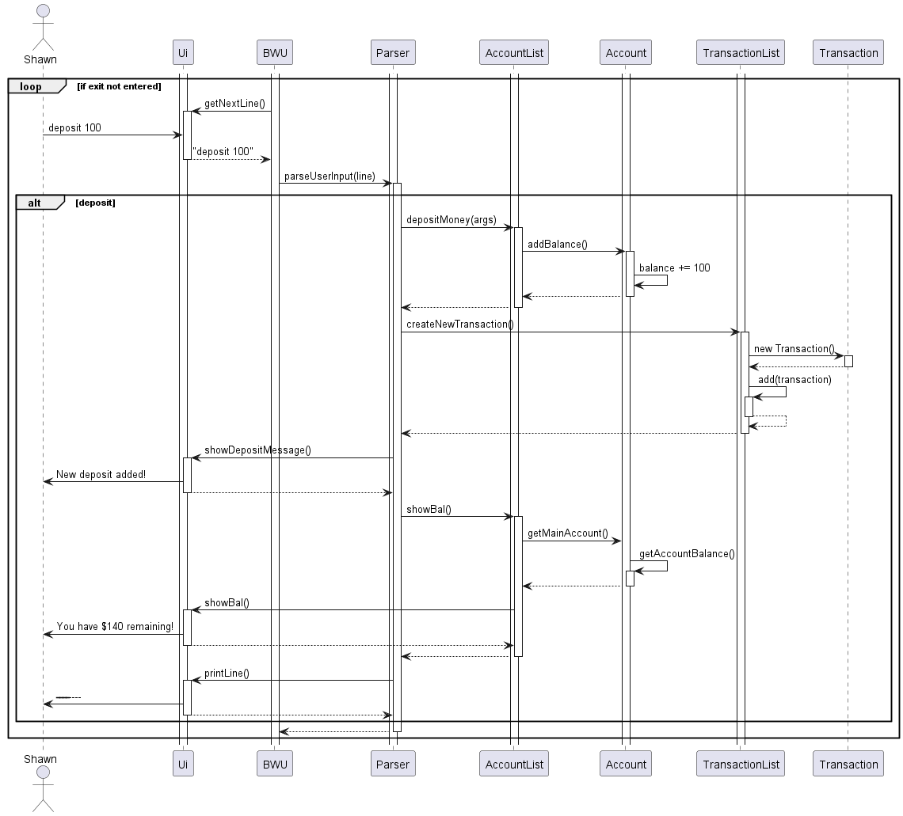

# Developer Guide

* [Acknowledgements](#acknowledgements)
* [Setting up, getting started](#setting-up-getting-started)
* [Design](#design)
    * [Architecture](#architecture)
    * [UI Component](#UI-Component)
    * [Parser Component](#parser-component)
    * [BankWithUs Component](#bankwithus-component)
    * [Account Component](#account-component)
    * [AccountList Component](#accountlist-component)
    * [SaveGoal Component](#saveGoal-component)
    * [Storage Component](#storage-component)
    * [Withdrawal Limit Component](#withdraw limit checker-Component)
    * [Transaction Component](#transaction-Component)
    * [TransactionList Component](#transactionlist-component)
* [Implementation](#implementation)
    * [Account related Feature](#Account-feature)
    * [saveGoal related Feature](#SaveGoal-feature)
    * [transaction Related Feature](#transaction-feature)

* [Appendix: Requirements](#appendix-requirements)
    * [Product scope](#product-scope)
    * [Target user profile](#target-user-profile)
    * [Value proposition](#value-proposition)
    * [User Stories](#user-stories)
    * [Non-Functional Requirements](#non-functional-requirements)
    * [Glossary](#glossary)

---

## Acknowledgements

{list here sources of all reused/adapted ideas, code, documentation, and third-party libraries -- include links to the original source as well}

## Setting up, getting started

---

## Design & implementation

{Describe the design and implementation of the product. Use UML diagrams and short code snippets where applicable.}

### Design

### Architecture

**Interactions**

The sequence diagram below shows how components interact with each other when the user issues the command `deposit 100`.

### UI-Component
Class: `Ui.java`

*  contains all code that interfaces directly with the CLI

### Parser-Component
Class: `Parser.java`

* determines what the program would do with the input retrieved from the CLI

### Account-Component
Class: `Account.java`

The `Account` component:

* contains `name`, `balance`, `SaveGoal`, `withdrawChecker` attribute
* stores and manages all the account details that pertains to one account.

### AccountList-Component

Class: `AccountList.java`

The `AccountList` component:

* Is an ArrayList<Accounts> that contains the various different accounts that the user has.
* The accountList is used to navigate between accounts for the switch-to feature
* when a new account is created it is appended to teh AccountList array

### BankWithUs-Component
Class: `bankWithUS.java`

The `BankWithUs` component:

* The Main Class
* the whole program executes through the bankWithUs class

### SaveGoal-Component
Class: `SaveGoal.java`

The `saveGoal` component:

* Allows users to add a savings goal
* allows users to add a deadline to the savings goal

### Storage-Component
Class: `Storage.java`

The `Storage` component:

* Handles storing data in the save files and also loading data, if any, when program opens.

### Withdraw-Limit-Checker-Component
Class: `WithdrawalChecker.java`

### Transaction-Component
Class: `Transaction.java`

The `Transaction` component:

* Stores the details of a transaction

### TransactionList-Component
Class: `TransactionList.java`

The `TransactionList` component:
* Contains an ArrayList<Transaction> that contains the various different transactions that the user has.
* Has methods to add and view transactions

---

## Implementation
* [Account related Feature](#account-feature)
* [saveGoal related Feature](#savegoal-feature)
* [transaction Related Feature](#transaction-feature)

---

## Non-Functional Requirements

{Give non-functional requirements}

## Glossary

* *glossary item* - Definition

## Appendix: Requirements

### Product scope

BankWithUs is a powerful and user-friendly CLI-based banking system 
that provides users with an easy and quick way to manage their financial 
transactions and budget accordingly. With its wide range of features and 
easy-to-use command syntax, BankWithUs makes it simple for users to manage their finances on the go.

### Target user profile

The target audience for the command line-based Banking System is individuals who value 
efficiency and simplicity in their financial management. This group includes students, 
freelancers, and small business owners who are looking for a fast and straightforward way to manage their finances.

### Value proposition

Fast typers may benefit more from the CLI 
version of the banking system as it allows for 
quick navigation and interaction with the system using keyboard shortcuts. 
This can lead to a faster and more efficient workflow compared to using a graphical user interface (GUI), 
which may require more clicks and navigation. Additionally, fast typers may prefer the simplicity and 
minimalism of a CLI interface, as it provides only the essential information and features needed to manage their finances.

### User Stories

| Version | As a ... | I want to ...                            | So that I can ...                                                                       |
|---------|----------|------------------------------------------|-----------------------------------------------------------------------------------------|
| v1.0    | user     | Add deposits                             | so that I can check my financial status.                                                |
| v1.0    | user     | Withdraw money                           | so that i can see the effect of my spending on balance                                  |
| v1.0    | user     | view account                             | so that i can keep track of my minimum balance                                          |
| v2.0    | user     | add a withdrawal limit                   | so that i can be forced to maintain a frugal habit                                      |
| v2.0    | user     | add a savings goal                       | so that i can keep track of my spendings in tandem with my savings goal                 |
| v2.0    | user     | add a new account                        | so that i can categorise my accounts and manage financial better                        |
| v2.0    | user     | switch account                           | so that i can navigate between the various accounts i have and keep track of finacnials |
| v2.0    | user     | list all the command that can be used    | so that i can have a basic overview of the apps functionalities                         |

### Non-Functional Requirements

{Give non-functional requirements}

### Glossary

* *glossary item* - Definition

## Instructions for manual testing

{Give instructions on how to do a manual product testing e.g., how to load sample data to be used for testing}
